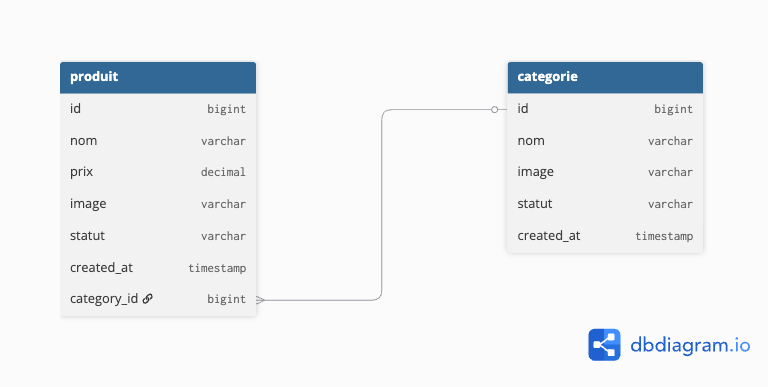

[](https://github.com/sihemht/helloCseTestFullStack/actions)

## Hello CSE - Test Fullstack (API Laravel)

Ce projet est une API REST développée avec Laravel, qui permet la gestion d'un catalogue de produits et de leurs catégories. 
L'architecture a été pensée pour être propre, scalable et testée.

## Fonctionalités

- Gestion des produits (CRUD)
- Gestion des category (Crud)
- Flitrage
- Upload d'image
- Standarisation des reponses
- Sécurité et validation

## Architecture base de données
Le projet repose sur une relation One-To-Many (Une catégorie possède plusieurs produits).


## Technologies
- PHP8.3 / Laravel 12
- Mysql
- PHPunit


## Instalation

**Cloner le projet** 
```bash
git clone <https://github.com/sihemht/helloCseTestFullStack>
```

```bash
cd helloCseTestFullStack
```

**Installer les dépendenses PHP**
```bash
composer install
```

**Configuration de l'environnement**
```bash 
cp .env.example .env
```

**Générer la clé d'application**
```bash
php artisan key:generate
```

**Lancer les migrations et les seeders**
```bash
php artisan migrate --seed
```

**Lancer le serveur local**
```bash
php artisan serve
```

**Exécution des Tests**
```bash
php artisan test 
```

## Endpoints API
```bash
php artisan route:list
```
**Catégories (/api/categories)**
- GET /api/categories : Liste toutes les catégories
- POST /api/categories : Crée une catégorie
- GET /api/categories/{id} : Détail d'une catégorie
- PATCH /api/categories/{id} : Modifier une catégorie
- DELETE /api/categories/{id} : Supprimer une catégorie

## Produits (/api/products)

- GET /api/products : Liste tous les produits
- GET /api/products?category_id={id} : Filtre par catégorie
- POST /api/products : Crée un produit
- GET /api/products/{id} : Détail d'un produit
- PATCH /api/products/{id} : Modifier un produit
- DELETE /api/products/{id} : Supprimer un produit

## Postman collection

Une collection Postman est mise à disposition

1. Les fichiers se trouve ici : `/postman/Category.postman_collection.json` &  `/postman/Product.postman_collection.json`
2. Ouvrez Postman, cliquez sur **Import** et glissez-déposez ces fichiers JSON.
3. Configurer la variable d'environnement `base_url` sur `http://127.0.0.1:8000`.
